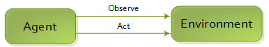

Reinforcement learning 
======================

The core concept are the following : an Agent observe the Environment, choose its action and the environment give him another observation and so on. The main loop is controlled by the Engine.

