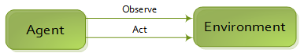

Reinforcement learning 
======================

The core concept are the following : an Agent observe the Environment, choose its action and the environment give him another observation and so on. The main loop is controlled by the Engine.

One step ahead, the Agent is part of the Environment and observes the State, which is also part of the environment. The Environment apply the action of the Agent to modify the State.

