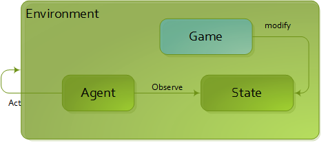

Reinforcement learning 
======================

Here is a step-by-step description of the RL architecture of MLSurvey.

First step : Agent and Environment
----------------------------------
The core concept are the following : an Agent observe the Environment, choose its action and the environment give him another observation and so on. The main loop is controlled by the Engine.

.. image:: images/explain1.png

State, Agent inside Environment
-------------------------------

One step ahead, the Agent is part of the Environment and observes the State, which is also part of the environment. The Environment apply the action of the Agent to modify the State.

.. image:: images/explain2.png

Introducing Game
----------------

Ultimatly the rules which control the evolution of the state of the environment is defined outside the environment. The Game class defines all static data and rules of the evolution.

More "realistic": Agent inside State
------------------------------------

We can now include the Agent into the State.

At this step, it is time to begin the understanding of the creation/init workflow since it will become more complex in future.

Introducing objects
-------------------

In order to be able to describe the state, we introduce a more complex structure adding Object, ObjectState, Characteristics and BaseObject.

It is important to understand the initialization process as seen in the following schema. Note that, at that step, game initialize a default state with one agent, one object which both have one characteristics containing the step number. The following schema shows only the creation of Agent but the process is the same for the Object.
All BaseObject are created calling :code:`Environment.create_object()` method.

